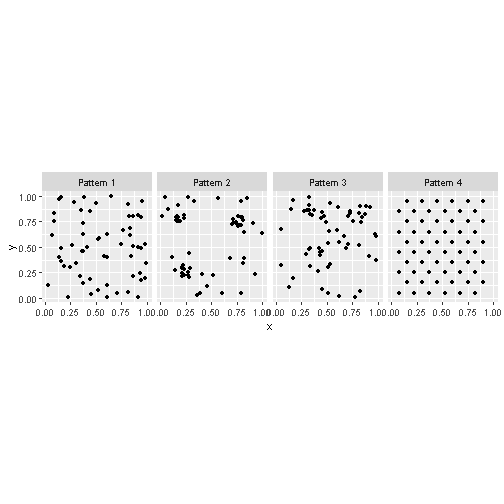
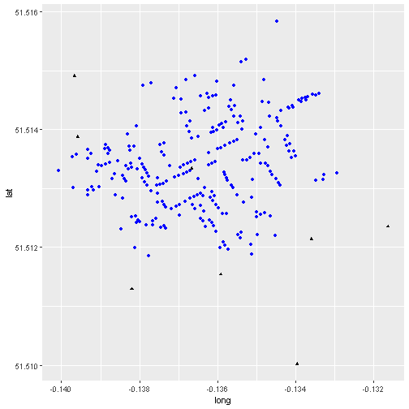
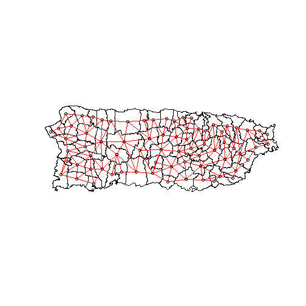
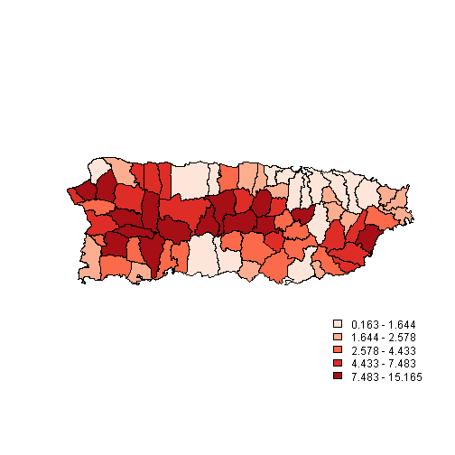
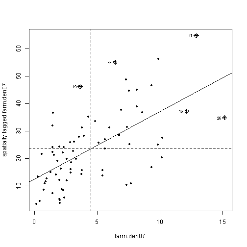
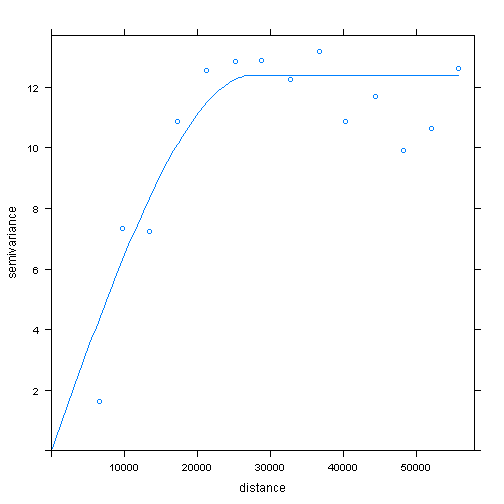
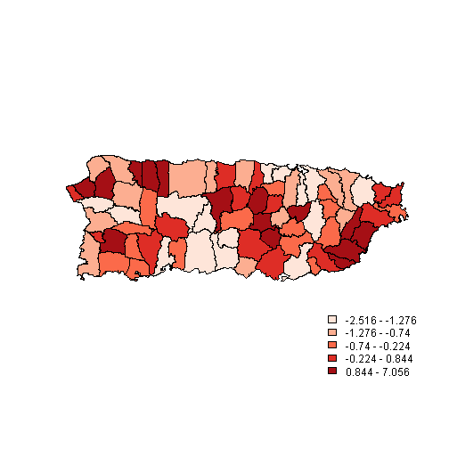

Presentation
========================================================
author: Parmanand Sinha
date: 
autosize: true

Topics
========================================================

- Representing geographical data in R
- dataset
- Finding non-randomness in point maps using spatstat

- Detection and measurement of spatial autocorrelation in lattice data using spdep

- Creating contour-type maps and semivariance using inverse distance weighting and geostatistical methods using gstat


Data set
========================================================

```
           x         y   Pattern
1 0.94197211 0.7974379 Pattern 1
2 0.13781785 0.3987660 Pattern 1
3 0.91724039 0.5009251 Pattern 1
4 0.44506391 0.8496535 Pattern 1
5 0.08929414 0.7491451 Pattern 1
6 0.83093139 0.6813998 Pattern 1
```

```
  X       long      lat Id Count
1 0 -0.1379301 51.51342  1     3
2 1 -0.1378831 51.51336  2     2
3 2 -0.1378529 51.51332  3     1
4 3 -0.1378120 51.51326  4     1
5 4 -0.1377668 51.51320  5     4
6 5 -0.1375369 51.51318  6     2
```

```
     X       long      lat  Id Count
1    1 -0.1366679 51.51334 251     1
2 1100 -0.1395862 51.51388 252     1
3  250 -0.1396710 51.51491 253     1
4  310 -0.1316299 51.51235 254     1
5  410 -0.1335944 51.51214 255     1
6  510 -0.1359191 51.51154 256     1
```

Point Patterns
========================================================


- A point pattern is a statistical map where the location of the event is the outcome of a process 
- A point pattern is given by a set of events of interest that are observed in a region $R$
- A region has an infinite number of points (coordinates) on the plane 


Processes and Point Patterns
========================================================
-  A key question of interest is whether the pattern is random
- Non-random patterns are likely the outcome of some meaningful process
- Deciding whether the pattern is random or not is the initial step towards developing hypotheses about the underlying process 

Tidyverse and plotting
========================================================
'Tidyverse' is a collection of R packages designed for data science used in everyday data analyses  


```r
ggplot() + 
  geom_point(data = PointPatterns, aes(x = x, y = y)) + facet_grid(.~ Pattern) +
  coord_fixed()
```




The function 'ggplot' is used for data visualization - it creates a graph. The function 'geom_point' tells R you want to create a plot of points. 'data = snow_deaths' tells R you want to use the 'snow_deaths' dataframe. 'aes' stands for aesthetics of your graph where 'x = long' sets the x axis to 'long', where 'y = lat' sets the y axis to 'lat', where 'color = blue' colours the points blue and 'shape = 16' assigns the shape of the points - in this case, '16' are circles and '17' are triangles  


```r
ggplot() +
  geom_point(data = snow_deaths, aes(x = long, y = lat), color = "blue", shape = 16) +
  geom_point(data = snow_pumps, aes(x = long, y = lat), color = "black", shape = 17)
```




```r
library(spdep)
library(RColorBrewer)
library(classInt)
library(maptools)
```


```r
pr <- readShapePoly("./data/PuertoRico_SPCS.shp")
pr.nb <- read.gal("./data/PuertoRico.GAL")
pr.nb<-poly2nb(pr)
pr.listw <- nb2listw(pr.nb, style="B")
```


```r
# Plotting Spatal connectivity 
cent <- coordinates(pr)
plot(pr, lwd=1.5)
plot(pr.nb, cent, add=T, col="red")
```




```r
# Farm Density in 2007
farm.den07 <- pr$nofarms_07/pr$area

# Mapping Farm Density in 2007
#pal.gray <- gray.colors(5)
pal.red <- brewer.pal(5,"Reds")
q5.den <- classIntervals(farm.den07,5,style="quantile") 
cols.den <- findColours(q5.den, pal.red)
plot(pr, col=cols.den)
brks.den <- round(q5.den$brks,3)
leg.txt  <- paste(brks.den[-6], brks.den[-1], sep=" - ")
legend("bottomright", fill=attr(cols.den,"palette"), legend=leg.txt ,bty="n")
```




```r
# Spatial autocorrelation tests
moran.test(farm.den07, pr.listw)
```

```

	Moran I test under randomisation

data:  farm.den07  
weights: pr.listw    

Moran I statistic standard deviate = 4.7987, p-value = 7.986e-07
alternative hypothesis: greater
sample estimates:
Moran I statistic       Expectation          Variance 
      0.334257491      -0.013888889       0.005263585 
```

```r
geary.test(farm.den07, pr.listw)
```

```

	Geary C test under randomisation

data:  farm.den07 
weights: pr.listw 

Geary C statistic standard deviate = 2.4637, p-value = 0.006876
alternative hypothesis: Expectation greater than statistic
sample estimates:
Geary C statistic       Expectation          Variance 
      0.773159440       1.000000000       0.008477634 
```

```r
# Moran Scatterplot
moran.plot(farm.den07, pr.listw, pch=20)
```




```r
# Variogram
p_load(gstat)
pr.v <- variogram(farm.den07 ~ 1,  pr)
pr.v.fit <- fit.variogram(pr.v, vgm(11,"Sph", "30000", 1))
plot(pr.v, pr.v.fit)
```



```r
# Farm Density in 2002
farm.den02 <- pr$nofarms_02/pr$area
```


```r
# Run a regression model
lm.farm <- lm(farm.den07 ~ farm.den02)
summary(lm.farm)
```

```

Call:
lm(formula = farm.den07 ~ farm.den02)

Residuals:
    Min      1Q  Median      3Q     Max 
-2.5157 -1.1769 -0.5443  0.5473  7.0563 

Coefficients:
            Estimate Std. Error t value Pr(>|t|)    
(Intercept)  1.56014    0.31353   4.976 4.37e-06 ***
farm.den02   0.61161    0.04692  13.035  < 2e-16 ***
---
Signif. codes:  0 '***' 0.001 '**' 0.01 '*' 0.05 '.' 0.1 ' ' 1

Residual standard error: 1.849 on 71 degrees of freedom
Multiple R-squared:  0.7053,	Adjusted R-squared:  0.7011 
F-statistic: 169.9 on 1 and 71 DF,  p-value: < 2.2e-16
```

```r
lm.morantest(lm.farm,pr.listw)
```

```

	Global Moran I for regression residuals

data:  
model: lm(formula = farm.den07 ~ farm.den02)
weights: pr.listw

Moran I statistic standard deviate = 2.0715, p-value = 0.01916
alternative hypothesis: greater
sample estimates:
Observed Moran I      Expectation         Variance 
      0.12765978      -0.02096606       0.00514772 
```


```r
# Mapping residuals of the regression model
res <- resid(lm.farm)
q5.res <- classIntervals(res,5,style="quantile")
cols.res <- findColours(q5.res, pal.red)
plot(pr, col=cols.res)
brks.res <- round(q5.res$brks,3)
leg.txt  <- paste(brks.res[-6], brks.res[-1], sep=" - ")
legend("bottomright", fill=attr(cols.res,"palette"), legend=leg.txt ,bty="n")
```


